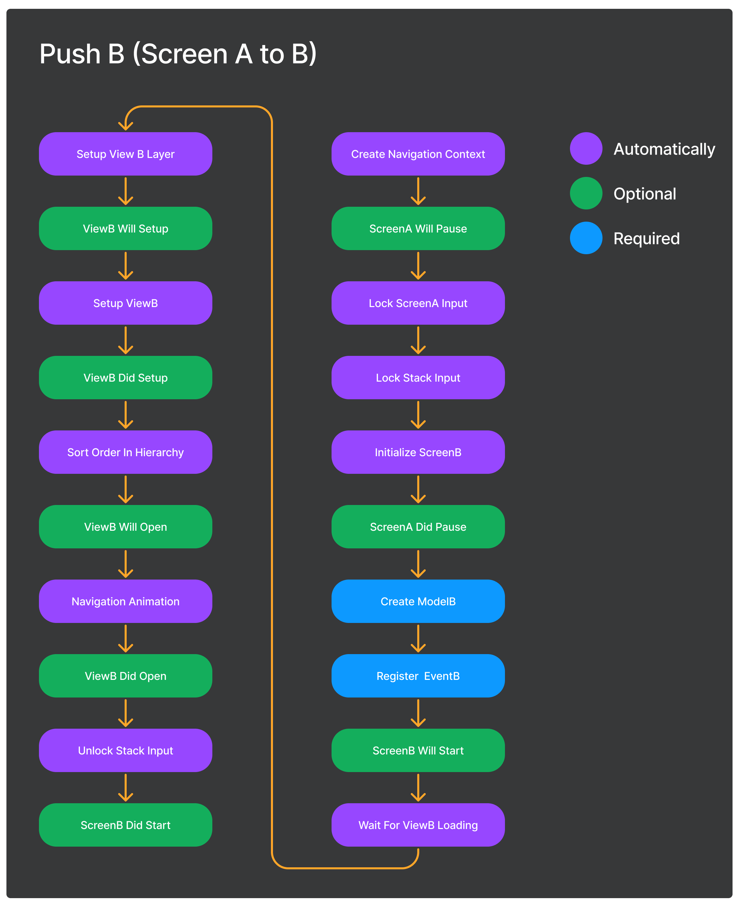

# Meek MVP (Model-View-Presenter) 
Meekの画面遷移・管理機能を用いてMVPアーキテクチャで実装するためのパッケージです。

## Getting Started

[NavigationStack](../Meek.NavigationStack/README_JA.md) を合わせて読むことで、より深く使い方を理解できます。

### Install Package
以下をpackage.jsonに追加してください。  
デフォルトでは、DIコンテナとして[VContainer](https://github.com/hadashiA/VContainer)を使用しています。
```json
{
  "dependencies": {
    "jp.amatech.meek": "https://github.com/azumausu/Meek.git?path=Assets/Packages/Meek",
    "jp.amatech.meek.navigationstack": "https://github.com/azumausu/Meek.git?path=Assets/Packages/Meek.NavigationStack",
    "jp.amatech.meek.ugui": "https://github.com/azumausu/Meek.git?path=Assets/Packages/Meek.UGUI",
    "jp.amatech.meek.vcontainer": "https://github.com/azumausu/Meek.git?path=Assets/Packages/Meek.VContainer",
    "jp.amatech.meek.mvp": "https://github.com/azumausu/Meek.git?path=Assets/Packages/Meek.MVP",
    "jp.hadashikick.vcontainer": "https://github.com/hadashiA/VContainer.git?path=VContainer/Assets/VContainer"
  }
}
```
また、MVPパターンでの実装を行う場合は、[UniRx](https://github.com/neuecc/UniRx) を使用することをお勧めします。

## Entry Point
```csharp
using Meek;
using Meek.MVP;
using UnityEngine;

namespace Demo
{
    public class Main : MonoBehaviour
    {
        [SerializeField] private InputLocker _inputLocker;
        [SerializeField] private PrefabViewManager _prefabViewManager;
        
        public void Start()
        {
            // アプリケーションを作成します。
            var app = MVPApplication.CreateRootApp(
                // アプリケーションの初期化時にオプションを指定します。
                new MVPRootApplicationOption()
                {
                    // DIコンテナを作成するためのファクトリメソッドです。
                    ContainerBuilderFactory = x => new VContainerServiceCollection(x),
                    // 画面遷移時に入力をロックするためのクラスです。
                    InputLocker = _inputLocker,
                    // 画面遷移時に表示するプレハブを管理するクラスです。
                    PrefabViewManager = _prefabViewManager,
                },
                // 使用する画面のクラスや機能を登録します。
                x =>
                {
                    // App Services
                    x.AddSingleton<GlobalStore>();
                    
                    // Screen
                    x.AddTransient<SplashScreen>();
                    x.AddTransient<SignUpScreen>();
                    x.AddTransient<LogInScreen>();
                    x.AddTransient<TabScreen>();
                    x.AddTransient<ReviewScreen>();
                }
            );
            // アプリケーションを起動する最初のScreenを指定します。
            app.RunAsync<SplashScreen>().Forget();
        }
    }
}
```
`MVPApplication.CreateRootApp`を呼び出すことで、アプリケーションを作成します。
アプリケーションを作成した後に、`app.RunAsync<TScreen>`を呼び出すことで、最初の画面を表示します。

### InputLocker
画面遷移時にユーザー入力をロックするためのクラスです。
以下のInterfaceを実装する必要があります。
```csharp
public interface IInputLocker
{
    // Inputをロック機能を実装してください。
    IDisposable LockInput();

    // Inputをロックしているかどうかを返してください
    public bool IsInputLocking { get; }
}
```
Demoでは、以下のように実装しています。
```csharp
public class InputLocker : MonoBehaviour, IInputLocker
{
    // Unity uGUIのImageコンポーネントです。
    [SerializeField] private Image _inputBlocker;
    
    public IDisposable LockInput()
    {
        _inputBlocker.enabled = true;
        return new Disposer(() => _inputBlocker.enabled = false);
    }
    
    public bool IsInputLocking => _inputBlocker.enabled;
}
```
### PrefabViewManager
作成されたPrefabを管理するためのクラスです。  
以下のInterfaceを実装する必要があります。
```csharp
public interface IPrefabViewManager
{
    // 管理しているPrefabの描画順を変更する処理を実装してください。
    // 画面遷移時に呼び出されます。
    void SortOrderInHierarchy(NavigationContext context);
    
    // 作成されたPrefabをHierarchyに追加する処理を実装してください。
    void AddInHierarchy(PrefabViewHandler handler);
}
```

Demoでは、以下のように実装しています。
```csharp
public class PrefabViewManager : MonoBehaviour, IPrefabViewManager
{
    [SerializeField] private Transform _rootNode;
    
    void IPrefabViewManager.AddInHierarchy(PrefabViewHandler handler)
    {
        // 配置するNodeに合わせてLayerを設定します。
        handler.RootNode.gameObject.SetLayerRecursively(_rootNode.gameObject.layer);
        handler.RootNode.SetParent(_rootNode);
    }

    void IPrefabViewManager.SortOrderInHierarchy(NavigationContext navigationContext)
    {
        // 新しく作成されたものが最前面に来るように、Hierarchyの順番を変更します。
        var navigationService = navigationContext.AppServices.GetService<StackNavigationService>();
        var uis = navigationService.ScreenContainer.Screens.OfType<StackScreen>().Select(x => x.UI);
        foreach (var ui in uis)
        {
            foreach (var prefabView in ui.ViewHandlers.Reverse().OfType<PrefabViewHandler>())
                prefabView.RootNode.SetAsFirstSibling();
        }
    }
}
```


## MVP(Model-View-Presenter)
MeekのMVPアーキテクチャは、以下のような構成になっています。  
  
通常のMVPアーキテクチャとの違いは、PresenterではなくScreenがModelを更新するところです。
また、PresenterをロードするとModelクラスが自動でPresenterにDIされます。
### Screen
Screenは画面を表すクラスです。
MVPアーキテクチャで実装する場合は、以下の役割を持ちます。
- Modelの初期化
- Modelの更新
- Presenterの初期化
- Presenterのイベントを購読
- 他Screenへの遷移

```csharp
public class FavoritesScreen : MVPScreen<FavoritesModel>
{
    // Modelを作成します。
    protected override async ValueTask<FavoritesModel> CreateModelAsync()
    {
        // DIコンテナに登録したServiceは、
        // コンストラクタインジェクションかベースクラスが保持しているAppServicesから取得できます。
        var globalStore = AppServices.GetService<GlobalStore>();
        return await Task.FromResult(new FavoritesModel(globalStore));
    }

    // Screenのライフサイクルイベントを購読します。
    protected override void RegisterEvents(EventHolder eventHolder, FavoritesModel model)
    {
        // Screenがアクティブになる前に呼び出されます。
        eventHolder.ScreenWillStart(async () =>
        {
            // Presenterをロードします。
            var presenter = await LoadPresenterAsync<FavoritesPresenter>();
            
            // Presenterが公開しているイベントを購読する場合は以下に記述します。
        });
    }
}
```
Screenは、`MVPScreen<TModel>`を継承します。また、`CreateModelAsync`と`RegisterEvents`を実装する必要があります。  
`CreateModelAsync`は、Modelを作成します。 Serverとの通信などの非同期処理を挟めるようにasync/awaitを使用しています。  
`RegisterEvents`は、[ScreenLifecycle](#screen-lifecycle)で定義されているイベントを購読し必要な処理を実装します。  
サンプルでは、`ScreenWillStart`（新しく作成されたScreenが開始される前に呼ばれる）を使用してPresenterをロードしています。

#### Dispatch
他のScreenに対してイベントを送りたい場合は、`Dispatch`を使用します。  
送信する側の実装
```csharp
// Screenクラス内で、Dispatchを呼び出します。
Dispatch(new ReviewEventArgs()
{
    ProductId = model.ProductId.Value,
    IsGood = true
});
```
受け取る側の実装
```csharp
protected override void RegisterEvents(EventHolder eventHolder, HomeModel model)
{
    // EventHolderを介して、Dispatchされたイベントを購読します。
    eventHolder.SubscribeDispatchEvent<ReviewEventArgs>(x =>
    {
        model.AddProduct(x.ProductId, x.IsGood);
        return true;
    });
}
```
### Model
Modelは画面の状態を表すクラスです。
1つのScreenにつき1つのModelを持ちます。  
`IDisposable`を実装すると、Screenの破棄時に自動で呼び出されます。
```csharp
public class LogInModel
{
    // Modelの状態をReactivePropertyで定義します。
    private ReactiveProperty<string> _email = new();
    private ReactiveProperty<string> _password = new();
    
    public IReadOnlyReactiveProperty<string> Email => _email;
    public IReadOnlyReactiveProperty<string> Password => _password;
    
    // Modelの状態を更新する関数を実装します。
    public void UpdateEmail(string value)
    {
        _email.Value = value;
    }
    
    public void UpdatePassword(string value)
    {
        _password.Value = value;
    }

    public async Task LogInAsync()
    {
        // Login 処理をここに実装します。
    }
}
```
### Presenter
Presenterは画面の表示を表すクラスです。  
Demoでは、`Resources/UI`ディレクトリにPrefabを配置しロードしています。


> **ヒント**  
> デフォルトでは`Resources/UI`をディレクトリからPrefabをロードしますが、
> アプリケーションを作成する時に、`IPresenterLoaderFactory`を渡すことでカスタムすることが可能です。

Prefabは下の画像のように、PrefabのルートにPresenterをアタッチする必要があります。


```csharp
public class LogInPresenter : Presenter<LogInModel>
{
    // ViewをSerializeFieldで定義します。
    [SerializeField] private InputFieldView _emailInputField;
    [SerializeField] private InputFieldView _passwordInputField;

    [SerializeField] private Button _backButton;
    [SerializeField] private Button _logInButton;

    // ViewのイベントをIObservableで定義します。
    public IObservable<Unit> OnClickBack => _backButton.OnClickAsObservable();
    public IObservable<Unit> OnClickLogIn => _logInButton.OnClickAsObservable();
    
    public IObservable<string> OnEndEditEmail => _emailInputField.OnEndEdit;
    public IObservable<string> OnEndEditPassword => _passwordInputField.OnEndEdit;

    // Modelのイベントを購読して、Viewの状態を更新する関数を呼び出します。
    protected override IEnumerable<IDisposable> Bind(LogInModel model)
    {
        yield return model.Email.Subscribe(x => _emailInputField.UpdateView(x));
        yield return model.Password.Subscribe(x => _passwordInputField.UpdateView(x));
    }
}
```
`Bind`でModelのイベントを購読して、Viewの状態を更新する関数を呼び出します。  
また、`Bind`以外に以下の関数を実装することができます。
```csharp
// Presenterがインスタンス化された時に呼び出されます。
protected virtual void OnInit() { }

// Presenterがロードされた時に呼び出されます。
// Presenterのロードに合わせて、UnityのSceneAssetや追加のPrefabをロードすることができます。
protected virtual Task LoadAsync(TModel model) { return Task.CompletedTask; }

// Bindの直前に呼び出されます。
// 主にPresenterが持つViewの初期化処理を行ます。
protected virtual void OnSetup(TModel model) { }

// Presenterが破棄された時に呼び出されます。
protected virtual void OnDeinit(TModel model) { }
```

その他の実装のポイント
- PresenterでModelの状態を書き換えない  
  => 複雑になるとScreenとPresenterの双方でModelを書き換えることで可読性が下がります
- Presenterには極力ロジックは含めない  
  => PresenterはViewとModelをBindingする役割に留めた方が可読性が上がります
- Presenterには独自の関数を定義しない  
  => 理想的にはPresenterはロジックを持たないので、関数を定義する必要がないはずです
- Viewは純粋関数で構成する  
  => SSOT(Single Source of Truth)に従って、必ずModelが持つ状態が唯一の情報源となるように実装しましょう。

> **ヒント**  
> InGameなど、複雑なViewを実装する必要がある場合はPresenterの配下に
> 別のアーキテクチャを採用することをお勧めします。

## Navigation API
Screenクラスの中で実行できます。
遷移の種類はデフォルトでは以下が実装されています。
- [Push](#push)
- [Pop](#pop)
- [InsertScreenBefore](#insertscreenbefore)
- [Remove](#remove)

> **注意**  
> StackNavigatorは、同じ型のScreenを同時に複数持つことができません。

> **ヒント**  
> より深く理解したい場合は、[NavigationStack](../Meek.NavigationStack/README_JA.md)も合わせてご確認ください。

### Push
Pushは、最前面に新しいScreenを追加します。  
追加するScreenは、Generic引数で指定します。
```csharp
PushNavigation.PushAsync<TabScreen>();
```
非同期関数なので、Push処理が終了するまで待機することも可能です。
また、以下のように`UpdateNextScreenParameter`を呼び出すことで次のScreenに状態を渡すことができます。
```csharp
PushNavigation
    // ここで状態を渡します。
    .UpdateNextScreenParameter(new ReviewScreenParameter(){ ProductId = id, })
    .PushAsync<ReviewScreen>().Forget();
```
上の例では、ReviewScreenに対してProductIdを渡しています。  
受け取る側のScreenでは以下のように実装します。
```csharp
// Generic引数の型にParameterを指定します。
public class ReviewScreen : MVPScreen<ReviewModel, ReviewScreenParameter>
{
    private readonly StackNavigationService _stackNavigationService;
    
    public ReviewScreen(StackNavigationService stackNavigationService)
    {
        _stackNavigationService = stackNavigationService;
    }
    
    // CreateModelAsync関数でParameterを受け取り、Modelを生成します。
    protected override async ValueTask<ReviewModel> CreateModelAsync(ReviewScreenParameter parameter)
    {
        return await Task.FromResult(new ReviewModel(parameter.ProductId));
    }
}
```
処理の流れは以下の図のようになります。

### Pop
Popは、最前面のScreenを破棄します。
```csharp
PopNavigation.PopAsync();
```
破棄された後に、前のScreenになんらかの状態を渡したい場合は`Dispatch`の利用を検討してください。
```csharp
// ボタンが押された
presenter.OnClickGood.Subscribe(async _ =>
{
    // Screenが破棄されるまで待機
    await PopNavigation.PopAsync();
    // Screenが破棄された後に、前のScreenに状態を渡す
    Dispatch(new ReviewEventArgs()
    {
        ProductId = model.ProductId.Value,
        IsGood = true
    });
});
```
処理の流れは以下の図のようになります。


### InsertScreenBefore
ScreenStackの途中に新しいScreenを追加します。
Genericの第一引数で指定したScreenの前面に、第二引数で指定したScreenを追加します。
```csharp
InsertNavigation.InsertScreenBeforeAsync<SplashScreen, HomeScreen>();
```

### Remove
ScreenStackの途中にあるScreenを破棄します。  
破棄したいScreenは、Generic引数で指定します。
```csharp
RemoveNavigation.RemoveAsync<SignUpScreen>();
```

### StackNavigatorの処理フロー（Advanced）
StackNavigatorは、以下のような処理フローで動作します。

```csharp
// NavigatorBuilderを作成します。
var stackNavigator = new NavigatorBuilder(navigatorBuilderOption =>
{
    // Optionパターンで設定を行います。
    navigatorBuilderOption.ContainerBuilder = option.ContainerBuilder;
    navigatorBuilderOption.ScreenContainer = typeof(StackScreenContainer);
}).ConfigureServices(serviceCollection =>
{
    // 必要なServiceをDIコンテナに登録します。
    serviceCollection.AddScreenNavigatorEvent();
    serviceCollection.AddInputLocker(x => { x.InputLocker = option.InputLocker; });
    serviceCollection.AddScreenUI();
    serviceCollection.AddNavigatorAnimation(
        x =>
        {
            // 使用する遷移アニメーションのロジックを登録します。
            x.Strategies.Add<PushNavigatorAnimationStrategy>();
            x.Strategies.Add<PopNavigatorAnimationStrategy>();
            x.Strategies.Add<RemoveNavigatorAnimationStrategy>();
            x.Strategies.Add<InsertNavigatorAnimationStrategy>();
        }
    );
    serviceCollection.AddUGUIAsMVP(x =>
    {
        x.UGUIOption.PrefabViewManager = option.PrefabViewManager;
        x.PresenterLoaderFactoryType = option.PresenterLoaderFactoryType;
    });
    serviceCollection.AddScreenLifecycleEvent();
}).Configure(app =>
{
    // Middlewareを実行順序を定義します。
    app.UseScreenNavigatorEvent();
    app.UseInputLocker();
    app.UseScreenUI();
    app.UseNavigatorAnimation();
    app.UseUGUI();
    app.UseScreenLifecycleEvent();
}).Build();
```

## Navigation Animation
StackNavigatorは、画面遷移時にアニメーションを再生することができます。
アニメーションには以下の4つの概念があります。
* Open - 新しいScreenが表示される時に再生されるアニメーションです
* Close - Screenが破棄される時に再生されるアニメーションです
* Show - 前面のScreenが破棄されて、自身のScreenに戻る時に再生されるアニメーションです
* Hide - 最前面のScreenの前面に、新しいScreenが追加される時に再生されるアニメーションです

### AnimationClipを使用したアニメーション
PresenterのPrefabのルートにAnimatorと専用のコンポーネントをアタッチすることで実現できます。


StackNavigatorは、画面遷移時にアニメーションを実行することができます。  
アニメーションは、AnimationClipを使用して設定し、 Presenter用のPrefabにAnimatorと専用のコンポーネントをアタッチすることで設定できます。
1. NavigatorAnimationPlayerをPrefabのRootノードにアタッチする
2. NavigatorTweenByAnimationClipをアタッチする
3. NavigatorTweenByAnimationClipのAnimationClipとNavigationTypeを設定する

> **ヒント**  
> アニメーションウィンドウを開くと、AnimationClipの調整が可能です(NavigatorAnimationPlayerノードを選択している必要があります)。

## Screen Lifecycle
以下のイベントをScreenの`RegisterEvent`で登録することができます。

| EventName         | Description                               |
|-------------------|-------------------------------------------|
| ScreenWillStart   | 新しく作成されたScreenの処理が開始される直前に呼び出されます         |
| ScreenDidStart    | 新しく作成されたScreenの処理が開始された直後に呼び出されます         |
| ScreenWillDestroy | Screenの破棄処理の直前に呼び出されます                    |
| ScreenDidDestroy  | Screenの破棄処理の直後に呼び出されます                    |
| ScreenWillResume  | 前面のScreenが破棄され自身のScreenが最前面になる直前に呼び出されます  |
| ScreenDidResume   | 前面のScreenが破棄され自身のScreenが最前面になった直後に呼び出されます |
| ScreenWillPause   | 自身のScreenの前面に新しいScreenがPushされる直前に呼び出されます  |
| ScreenDidPause    | 自身のScreenの前面に新しいScreenがPushされた直後に呼び出されます  |
| ViewWillOpen      | 新しく作成されたScreenの表示アニメーションの直前に呼び出されます       |
| ViewDidOpen       | 新しく作成されたScreenの表示アニメーションの直後に呼び出されます       |
| ViewWillClose     | Screenの破棄アニメーションの直前に呼び出されます               |
| ViewDidClose      | Screenの破棄アニメーションの直後に呼び出されます               |
| ViewWillSetup     | PresenterのSetupの直前に呼び出されます                |
| ViewDidSetup      | PresenterのSetupの直後に呼び出されます                |