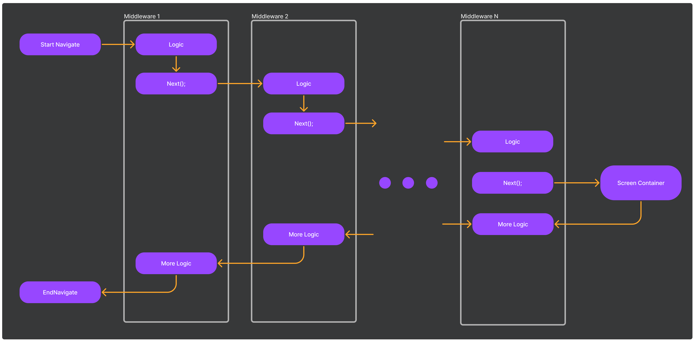

# Meek Navigation Stack

Meek の画面遷移機能を提供するパッケージです。

## Getting Started
既存のアーキテクチャを使用したい場合は、以下のページを参照してください。
* [Meek MVP (Model-View-Presenter)](../Meek.MVP/README_JA.md) 

### Install Package

以下をPackages/manifest.jsonに追加する必要があります。
```json
{
  "dependencies": {
    "jp.amatech.meek": "https://github.com/azumausu/Meek.git?path=Assets/Packages/Meek",
    "jp.amatech.meek.navigationstack": "https://github.com/azumausu/Meek.git?path=Assets/Packages/Meek.NavigationStack"
  }
}
```

## Key Concepts
Navigatorは以下の要素から構成されています。  
また、DIコンテナを用いてこれらを実装しています。
* [Screen](#screen)
* [ScreenContainer](#screencontainer)
* [Middleware](#middleware)


### Screen
画面を表すクラスです。  
画面のUIや状態を管理する責務を持ちます。  
`IScreen`を継承した`StackScreen`がデフォルトの実装です。


> **ヒント**
> StackScreenを継承することで、カスタムScreenを実装することができます。

### ScreenContainer
Screenを管理するクラスです。  
デフォルトではStackでScreenを保持する`StackScreenContainer`が使用されます。

### Middleware
MiddlewareはNavigationが実行された時の挙動が定義されています。  
[ASP.NET Core Middleware](https://learn.microsoft.com/en-us/aspnet/core/fundamentals/middleware/?view=aspnetcore-7.0) を参考にした実装になっています。


デフォルトでは以下のMiddlewareが実装されています。
* ScreenNavigatorEvent - Navigationの開始と終了をScreenに通知するためのMiddleware
* InputLocker - Navigation中にユーザー入力を無効化するためのMiddleware
* ScreenUI - ScreenのUIの生成・破棄を行うためのMiddleware
* NavigationAnimation - Navigationのアニメーションを行うためのMiddleware
* ScreenLifecycleEvent - Screenのライフサイクルイベントを発行するためのMiddleware

MVPアーキテクチャ用のStackNavigatorの初期化例です。
```csharp
var stackNavigator = new NavigatorBuilder(navigatorBuilderOption =>
{
    navigatorBuilderOption.ContainerBuilder = option.ContainerBuilder;
    navigatorBuilderOption.ScreenContainer = typeof(StackScreenContainer);
}).ConfigureServices(serviceCollection =>
{
    // DIコンテナにサービスを登録する
    serviceCollection.AddScreenNavigatorEvent();
    serviceCollection.AddInputLocker(x => { x.InputLocker = option.InputLocker; });
    serviceCollection.AddScreenUI();
    serviceCollection.AddNavigatorAnimation(
        x =>
        {
            x.Strategies.Add<PushNavigatorAnimationStrategy>();
            x.Strategies.Add<PopNavigatorAnimationStrategy>();
            x.Strategies.Add<RemoveNavigatorAnimationStrategy>();
            x.Strategies.Add<InsertNavigatorAnimationStrategy>();
        }
    );
    serviceCollection.AddUGUIAsMVP(x =>
    {
        x.UGUIOption.PrefabViewManager = option.PrefabViewManager;
        x.PresenterLoaderFactoryType = option.PresenterLoaderFactoryType;
    });
    serviceCollection.AddScreenLifecycleEvent();
}).Configure(app =>
{
    // Middlewareの実行順序を定義する。
    app.UseScreenNavigatorEvent();
    app.UseInputLocker();
    app.UseScreenUI();
    app.UseNavigatorAnimation();
    app.UseUGUI();
    app.UseScreenLifecycleEvent();
}).Build();
```
`ConfigureServices`の中で`ServiceCollection`に使用する機能を`Add`します。  
また、`Configure`でビルドされた`app`に対して、`Use`でMiddlewareの実行順序を定義します。  
> **ヒント**
> Middlewareの登録順序は上記をお勧めしています。また、カスタムMiddlewareの実装はライブラリを熟知するまでお勧めしません。

## Screen Lifecycle
以下のライフサイクルを提供しています。

| EventName         | Description                               |
|-------------------|-------------------------------------------|
| ScreenWillStart   | 新しく作成されたScreenの処理が開始される直前に呼び出されます         |
| ScreenDidStart    | 新しく作成されたScreenの処理が開始された直後に呼び出されます         |
| ScreenWillDestroy | Screenの破棄処理の直前に呼び出されます                    |
| ScreenDidDestroy  | Screenの破棄処理の直後に呼び出されます                    |
| ScreenWillResume  | 前面のScreenが破棄され自身のScreenが最前面になる直前に呼び出されます  |
| ScreenDidResume   | 前面のScreenが破棄され自身のScreenが最前面になった直後に呼び出されます |
| ScreenWillPause   | 自身のScreenの前面に新しいScreenがPushされる直前に呼び出されます  |
| ScreenDidPause    | 自身のScreenの前面に新しいScreenがPushされた直後に呼び出されます  |
| ViewWillOpen      | 新しく作成されたScreenの表示アニメーションの直前に呼び出されます       |
| ViewDidOpen       | 新しく作成されたScreenの表示アニメーションの直後に呼び出されます       |
| ViewWillClose     | Screenの破棄アニメーションの直前に呼び出されます               |
| ViewDidClose      | Screenの破棄アニメーションの直後に呼び出されます               |
| ViewWillSetup     | ViewのSetupの直前に呼び出されます                     |
| ViewDidSetup      | ViewのSetupの直後に呼び出されます                     |
これらは、`StackScreen`の
```csharp
protected abstract void RegisterEventsInternal(EventHolder eventHolder);
```
の中で登録することができます。  

## Navigation API
Meek の Navigation API は [MAUI](https://learn.microsoft.com/en-us/dotnet/maui/user-interface/pages/navigationpage?view=net-maui-7.0) の Navigation 機能を参考にしています。  
基本機能は、以下の4つがあります。
* Push - 最前面のScreenの上に新しいScreenを追加します
* Pop - 最前面のScreenを破棄します
* InsertScreenBefore - 指定したScreenの前面に新しいScreenを追加します
* Remove - 指定したScreenを破棄します

これらの4つの機能を組み合わせて、様々な画面遷移を実装します。  
また、Navigation機能は`StackNavigationService.cs`からアクセスします。

> **注意**  
> StackNavigatorは、同じ型のScreenを同時に複数持つことができません。
