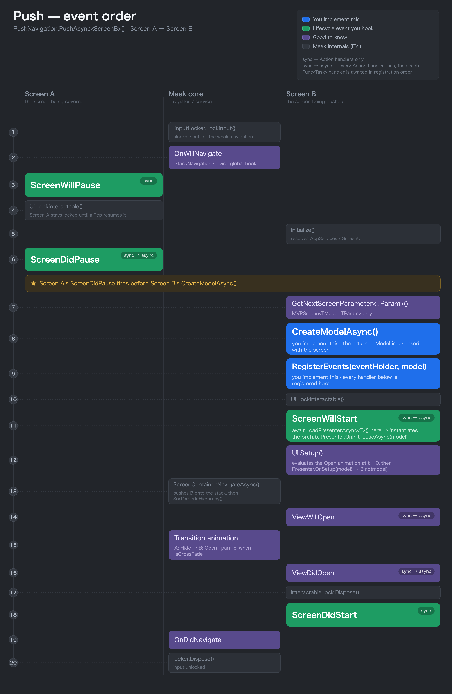
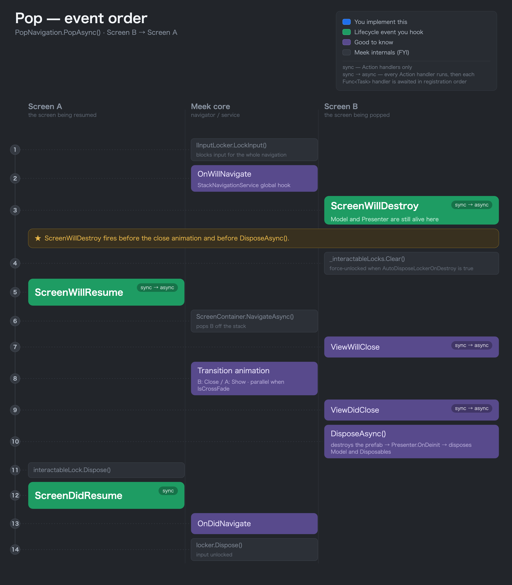
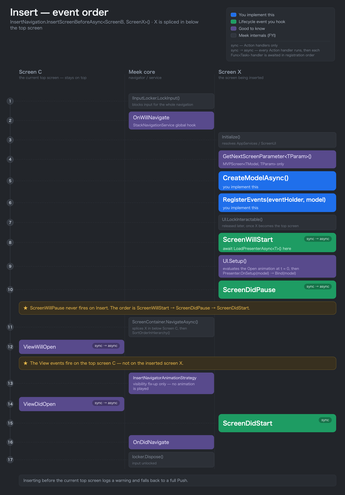
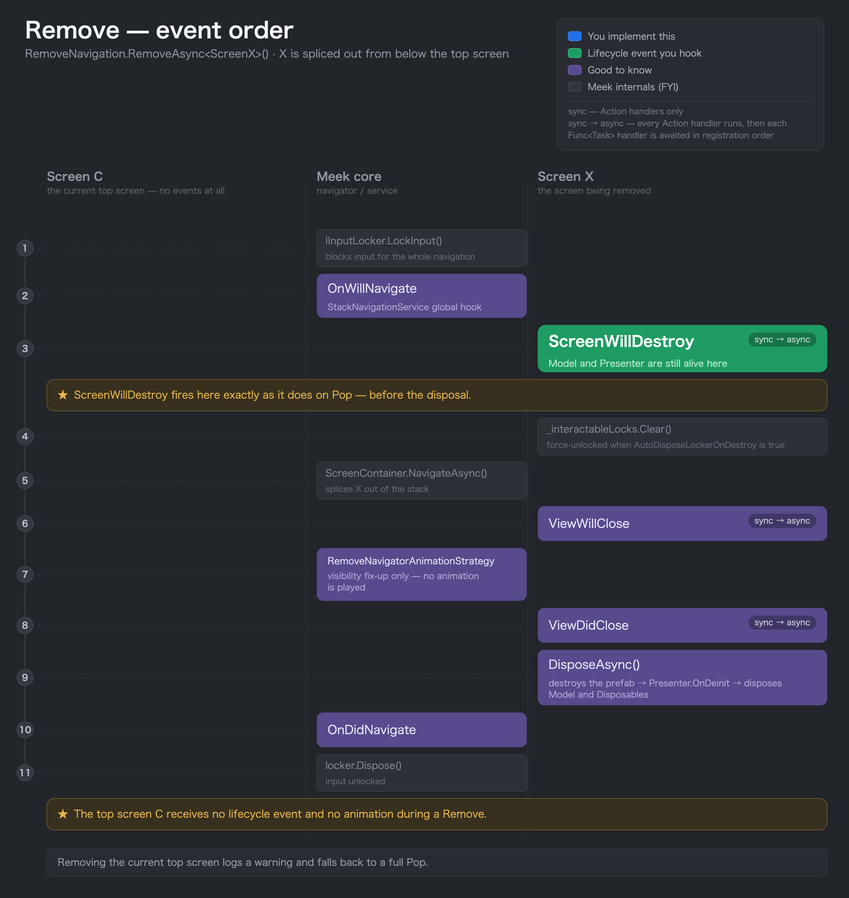

[Japanese Documentation (日本語)](README_JA.md)

# Meek

[](LICENSE.md)
[](https://unity.com/)
[](https://github.com/azumausu/Meek/releases)

A DI-based screen management framework for Unity with stack navigation and MVP architecture support.

[MeekDemo](https://user-images.githubusercontent.com/19426596/232242080-f2eac6e7-e1ae-48c3-9816-8aebae1f951b.mov)

> The images used in the demo are free content from [Nucleus UI](https://www.nucleus-ui.com/).

---

## Table of Contents

- [Features](#features)
- [Architecture Overview](#architecture-overview)
- [Requirements](#requirements)
- [Installation](#installation)
- [Quick Start](#quick-start)
- [Core Concepts](#core-concepts)
  - [Screen (MVP Pattern)](#screen-mvp-pattern)
  - [Navigation](#navigation)
  - [Event Order per Navigation](#event-order-per-navigation)
  - [DI Integration](#di-integration)
- [Usage](#usage)
  - [Creating a Screen](#creating-a-screen)
  - [Passing Parameters Between Screens](#passing-parameters-between-screens)
  - [Inter-Screen Communication (Dispatch)](#inter-screen-communication-dispatch)
  - [Transition Animations](#transition-animations)
- [In Depth](#in-depth)
  - [MVPScreen members you can use](#mvpscreen-members-you-can-use)
  - [Automatic disposal of Models and Presenters](#automatic-disposal-of-models-and-presenters)
  - [Navigation Builder options](#navigation-builder-options)
  - [Passing data via `CustomFeature`](#passing-data-via-customfeature)
  - [Receiving `StackNavigationContext` in lifecycle callbacks](#receiving-stacknavigationcontext-in-lifecycle-callbacks)
  - [Animation system internals](#animation-system-internals)
  - [Class architecture: Screen, ScreenUI, IViewHandler, Presenter](#class-architecture-screen-screenui-iviewhandler-presenter)
  - [Inspecting Navigation State (`StackNavigationService`)](#inspecting-navigation-state-stacknavigationservice)
- [Advanced Usage](#advanced-usage)
  - [Nested Navigation (Tabs)](#nested-navigation-tabs)
  - [Loading Presenter Prefabs via Addressables](#loading-presenter-prefabs-via-addressables)
  - [Multiple Navigators](#multiple-navigators)
  - [Hooking into Navigation Events](#hooking-into-navigation-events)
  - [Custom DI Container](#custom-di-container)
- [API Reference](#api-reference)
- [License](#license)

---

## Features

- **Stack-based Navigation** — Push, Pop, Insert, Remove, and BackTo screen transitions
- **DI Container Integration** — Every built-in feature is registered in the DI container, so it is easy to extend or replace by overriding the registration
- **Transition Animations** — Open/Close/Show/Hide are easy to configure, and extensible through the Strategy pattern
- **Screen Lifecycle Events** — Rich lifecycle hooks (WillStart, DidStart, WillPause, DidPause, WillResume, DidResume, WillDestroy)
- **Input Locking** — Automatic input blocking during transitions prevents double-tap issues
- **No Static Classes** — Instance-based design allows multiple independent navigators to coexist
- **Inter-Screen Communication** — Dispatch events across the screen stack without tight coupling

---

## Architecture Overview

Meek is organized into five modular packages:

```
┌─────────────────────────────────────────────────────────┐
│                    Your Application                     │
├───────────────┬───────────────────┬─────────────────────┤
│   Meek.MVP    │    Meek.UGUI      │  Meek.VContainer    │
├───────────────┴───────────────────┴─────────────────────┤
│                  Meek.NavigationStack                   │
├─────────────────────────────────────────────────────────┤
│                       Meek (Core)                       │
└─────────────────────────────────────────────────────────┘
```

| Package | Description |
|---------|-------------|
| **Meek** | Core interfaces and abstractions (`IScreen`, `INavigator`, `IServiceCollection`) |
| **Meek.NavigationStack** | Stack-based navigation, lifecycle events, animation strategies, input locking |
| **Meek.MVP** | MVP pattern support (`MVPScreen<TModel>`, `Presenter<TModel>`, auto-loading) |
| **Meek.UGUI** | Unity uGUI integration (animation components, `DefaultInputLocker`, `DefaultPrefabViewManager`) |
| **Meek.VContainer** | VContainer DI adapter (`VContainerServiceCollection`, `VContainerServiceProvider`) |

---

## Requirements

- **Unity 6000.0** (Unity 6) or newer
- **[VContainer](https://github.com/hadashiA/VContainer)** 1.13.2 or newer

---

## Installation

Add the following lines to your `Packages/manifest.json`:

```json
{
  "dependencies": {
    "jp.amatech.meek": "https://github.com/azumausu/Meek.git?path=Assets/Packages"
  }
}
```

---

## Quick Start

### 1. Create the Entry Point

Attach this `MonoBehaviour` to a GameObject in your scene. Place `DefaultInputLocker` and `DefaultPrefabViewManager` components on the GameObject and assign them in the Inspector.

```csharp
using Cysharp.Threading.Tasks;
using Meek;
using Meek.MVP;
using Meek.UGUI;
using UnityEngine;

public class Main : MonoBehaviour
{
    [SerializeField] private DefaultInputLocker defaultInputLocker;
    [SerializeField] private DefaultPrefabViewManager defaultPrefabViewManager;

    public void Start()
    {
        var container = new VContainerServiceCollection()
            .AddMeekMvp(new MvpNavigatorOptions()
            {
                // Pass your implementation that locks input during a transition
                InputLocker = defaultInputLocker,
                // Pass the class that manages the node where UI prefabs are created
                PrefabViewManager = defaultPrefabViewManager
            });

        // Register screens
        container.ServiceCollection.AddTransient<SplashScreen>();
        container.ServiceCollection.AddTransient<HomeScreen>();

        // Build and navigate to the first screen
        container.BuildAndRunMeekMvpAsync<SplashScreen>().Forget();
    }
}
```

### 2. Create a Model

```csharp
public class SplashModel
{
    // Add reactive properties here if needed
}
```

### 3. Create a Screen

```csharp
using System.Threading.Tasks;
using Meek.MVP;
using Meek.NavigationStack;
using UniRx;

public class SplashScreen : MVPScreen<SplashModel>
{
    // Create the model
    protected override async ValueTask<SplashModel> CreateModelAsync()
    {
        return await Task.FromResult(new SplashModel());
    }

    // Register handlers for the screen lifecycle events
    protected override void RegisterEvents(EventHolder eventHolder, SplashModel model)
    {
        // Screen start-up preparation event
        eventHolder.ScreenWillStart(async () =>
        {
            // Load the Presenter prefab
            var presenter = await LoadPresenterAsync<SplashPresenter>();

            presenter.OnClickStart.Subscribe(_ => PushNavigation.PushForget<HomeScreen>());
        });
    }
}
```

### 4. Create a Presenter

Place the Presenter prefab in `Resources/UI/SplashPresenter`.

```csharp
using System;
using System.Collections.Generic;
using Meek.MVP;
using UniRx;
using UnityEngine;
using UnityEngine.UI;

public class SplashPresenter : Presenter<SplashModel>
{
    [SerializeField] private Button _startButton;

    public IObservable<Unit> OnClickStart => _startButton.OnClickAsObservable();

    protected override IEnumerable<IDisposable> Bind(SplashModel model)
    {
        yield break; // No reactive bindings needed for this simple screen
    }
}
```

---

## Core Concepts

### Screen (MVP Pattern)

Meek uses a modified MVP (Model-View-Presenter) pattern where the **Screen** acts as the coordinator:

```
┌──────────────────────┐     ┌───────────┐     ┌──────────────┐
│        Screen        │────>│   Model   │<────│  Presenter   │
└──────────┬───────────┘     └───────────┘     └──────────────┘
           │
           │
           ▼
  Navigation API (Push/Pop, etc.)
```

- **Screen** (`MVPScreen<TModel>`) — Creates the Model, loads Presenters, registers lifecycle events, and handles navigation
- **Model** — Holds screen state using `ReactiveProperty<T>` for observable data
- **Presenter** (`Presenter<TModel>`) — A Unity prefab (`MonoBehaviour`) that binds Model data to UI elements via the `Bind()` method

A full list of members you can call inside a Screen is in [MVPScreen members you can use](#mvpscreen-members-you-can-use). Disposable models and Presenter bindings are released for you automatically — see [Automatic disposal of Models and Presenters](#automatic-disposal-of-models-and-presenters).

### Navigation

Meek provides five navigation operations:

| Operation | Method | Description |
|-----------|--------|-------------|
| **Push** | `PushNavigation.PushAsync<T>()` | Add a screen to the top of the stack |
| **Pop** | `PopNavigation.PopAsync()` | Remove the top screen from the stack |
| **Insert** | `InsertNavigation.InsertScreenBeforeAsync<TBeforeScreen, TInsertionScreen>()` | Insert a screen before a specified screen |
| **Remove** | `RemoveNavigation.RemoveAsync<T>()` | Remove a specific screen from the stack |
| **BackTo** | `BackToNavigation.BackToAsync<T>()` | Pop all screens until the specified screen is on top |

Each navigation builder supports method chaining and ships two terminal variants:

- **`Async`** — returns a `Task`, awaitable
- **`Forget`** — fire-and-forget

```csharp
// Awaitable
await PushNavigation.PushAsync<NextScreen>();

// Fire-and-forget
PushNavigation.PushForget<NextScreen>();
```

Each builder also exposes its own chainable options (parameters, cross-fade, skip-animation, `OnlyWhen`, etc.) and the `CustomFeature(key, value)` mechanism for passing arbitrary data alongside the navigation. The full per-builder matrix and parameter-passing details are documented in [Navigation Builder options](#navigation-builder-options) and [Passing data via `CustomFeature`](#passing-data-via-customfeature).

### Event Order per Navigation

Read each diagram top to bottom — that is the execution order. The colors indicate how much you touch each step while writing a screen.

- **Blue** — you must implement it (`CreateModelAsync` / `RegisterEvents`)
- **Green** — lifecycle events you hook regularly
- **Purple** — good to know (View events / transition animation / navigation hooks)
- **Gray** — framework internals, for reference only

The `sync` / `sync → async` badge on each event shows which handler shapes it accepts. `sync` takes `Action` handlers only, while `sync → async` runs every `Action` handler first and then awaits each `Func<Task>` handler in registration order.

#### Push



- **`ScreenWillStart` is where you load the Presenter.** Awaiting `LoadPresenterAsync<T>()` there is what lets the following `UI.Setup()` run `Presenter.OnSetup` / `Bind`.
- The previous screen's `ScreenDidPause` fires **before** the incoming screen's `CreateModelAsync()`, so put any teardown that must happen first in there.
- The previous screen's input lock is still held after the Push completes; it is released only when a Pop resumes that screen.

#### Pop



- **`ScreenWillDestroy` fires before the close animation.** The Model and Presenter are still alive at that point, so save any state you need there.
- The actual teardown (destroying the prefab → `Presenter.OnDeinit` → disposing the Model and `Disposables`) is handled by `DisposeAsync()` after the animation finishes.

<details>
<summary>Event order for Insert / Remove</summary>

#### Insert



- The inserted screen fires `ScreenWillStart` → `ScreenDidPause` → `ScreenDidStart` in that order, and **`ScreenWillPause` never fires**.
- `ViewWillOpen` / `ViewDidOpen` fire on the **current top screen**, not on the inserted one, and no transition animation is played.
- If the insertion target is already the top screen, Meek logs a warning and falls back to Push.

#### Remove



- `ScreenWillDestroy` fires just before the teardown, exactly as it does on Pop.
- The current top screen receives no lifecycle event and no transition animation at all.
- If the removal target is the top screen, Meek logs a warning and falls back to Pop.

</details>

> **BackTo** is not a single transition but a composite of the operations above. It removes the intermediate screens below the top one by one (`SkipAnimation` is enabled by default), then pops the top screen once — when the target is only one screen down it is just a Pop. Each sub-operation takes the input lock and fires `OnWillNavigate` / `OnDidNavigate` on its own.

Every lifecycle hook also has an overload that receives a `StackNavigationContext`. See [Receiving `StackNavigationContext` in lifecycle callbacks](#receiving-stacknavigationcontext-in-lifecycle-callbacks) for how to take it.

### DI Integration

Screens are registered in the DI container, so they can receive other classes through their constructor.

```csharp
// Register a singleton (shared across all screens)
container.ServiceCollection.AddSingleton<GlobalStore>();

// Register a screen (new instance per resolution)
container.ServiceCollection.AddTransient<HomeScreen>();

// Constructor injection works automatically
public class HomeScreen : MVPScreen<HomeModel>
{
    private readonly GlobalStore _globalStore;

    public HomeScreen(GlobalStore globalStore)  // Injected by DI
    {
        _globalStore = globalStore;
    }
}
```

---

## Usage

### Creating a Screen

#### Model with Reactive Properties

```csharp
using UniRx;

public class LogInModel
{
    private ReactiveProperty<string> _email = new();
    private ReactiveProperty<string> _password = new();

    public IReadOnlyReactiveProperty<string> Email => _email;
    public IReadOnlyReactiveProperty<string> Password => _password;

    public void UpdateEmail(string value) => _email.Value = value;
    public void UpdatePassword(string value) => _password.Value = value;
}
```

#### Screen with Reactive Bindings

```csharp
public class LogInScreen : MVPScreen<LogInModel>
{
    protected override async ValueTask<LogInModel> CreateModelAsync()
    {
        return await Task.FromResult(new LogInModel());
    }

    protected override void RegisterEvents(EventHolder eventHolder, LogInModel model)
    {
        eventHolder.ScreenWillStart(async () =>
        {
            var presenter = await LoadPresenterAsync<LogInPresenter>();

            presenter.OnClickBack.Subscribe(_ => PopNavigation.PopAsync().Forget());
            presenter.OnClickLogIn.Subscribe(_ => PushNavigation.PushAsync<TabScreen>().Forget());

            presenter.OnEndEditEmail.Subscribe(model.UpdateEmail);
            presenter.OnEndEditPassword.Subscribe(model.UpdatePassword);
        });
    }
}
```

> The example does not dispose the subscriptions, because the lifecycles of the Model and the Presenter are contained within the Screen.

#### Presenter with Data Binding

```csharp
using System;
using System.Collections.Generic;
using Meek.MVP;
using TMPro;
using UniRx;
using UnityEngine;
using UnityEngine.UI;

public class LogInPresenter : Presenter<LogInModel>
{
    [SerializeField] private TMP_InputField _emailInputField;
    [SerializeField] private TMP_InputField _passwordInputField;
    [SerializeField] private Button _backButton;
    [SerializeField] private Button _logInButton;

    public IObservable<Unit> OnClickBack => _backButton.OnClickAsObservable();
    public IObservable<Unit> OnClickLogIn => _logInButton.OnClickAsObservable();
    public IObservable<string> OnEndEditEmail => _emailInputField.onEndEdit.AsObservable();
    public IObservable<string> OnEndEditPassword => _passwordInputField.onEndEdit.AsObservable();

    protected override IEnumerable<IDisposable> Bind(LogInModel model)
    {
        yield return model.Email.Subscribe(x => _emailInputField.text = x);
        yield return model.Password.Subscribe(x => _passwordInputField.text = x);
    }
}
```

### Passing Parameters Between Screens

Use `MVPScreen<TModel, TParam>` to accept typed parameters:

```csharp
// Define a parameter class
public class ReviewScreenParameter
{
    public int ProductId;
}

// Screen that receives the parameter
public class ReviewScreen : MVPScreen<ReviewModel, ReviewScreenParameter>
{
    protected override async ValueTask<ReviewModel> CreateModelAsync(ReviewScreenParameter parameter)
    {
        return await Task.FromResult(new ReviewModel(parameter.ProductId));
    }

    protected override void RegisterEvents(EventHolder eventHolder, ReviewModel model) { /* ... */ }
}

// Push with parameter (from another screen)
PushNavigation
    .NextScreenParameter(new ReviewScreenParameter { ProductId = 42 })
    .PushAsync<ReviewScreen>()
    .Forget();
```

### Inter-Screen Communication (Dispatch)

Send events back to screens lower in the stack without tight coupling:

```csharp
// Define an event args class
public class ReviewEventArgs
{
    public int ProductId;
    public bool IsGood;
}

// Sending screen (ReviewScreen) — dispatches after popping
presenter.OnClickGood.Subscribe(async _ =>
{
    await PopNavigation.PopAsync();
    Dispatch(new ReviewEventArgs { ProductId = model.ProductId.Value, IsGood = true });
});

// Receiving screen (HomeScreen) — subscribes to the event
eventHolder.SubscribeDispatchEvent<ReviewEventArgs>(args =>
{
    model.AddProduct(args.ProductId, args.IsGood);
    return true; // Stop propagation
});
```

### Transition Animations

Meek supports four animation types: **Open**, **Close**, **Show**, **Hide**.

| Operation | Foreground (new screen) | Background (previous screen) |
|-----------|-------------------------|------------------------------|
| **Push**  | `Open` | `Hide` (kept underneath) |
| **Pop**   | `Show` (returns to top) | `Close` (the popped screen) |

- **Cross-fade vs sequential** — When `IsCrossFade(true)` is set, foreground and background animations run in parallel; otherwise they run sequentially.
- **View events** — `ViewWillOpen` / `ViewDidOpen` and `ViewWillClose` / `ViewDidClose` fire around the `Open` / `Close` animations only. The `Show` / `Hide` side has no `View*` event. For exactly where they fire, see [Event Order per Navigation](#event-order-per-navigation).

Control animation behavior per navigation:

```csharp
// Cross-fade: old and new screens animate simultaneously
PushNavigation.IsCrossFade(true).PushAsync<NextScreen>().Forget();

// Skip animation entirely
PushNavigation.SkipAnimation(true).PushAsync<NextScreen>().Forget();
```

For how clips are actually wired up on a Presenter prefab and how `IsCrossFade` / `SkipAnimation` are implemented internally, see [Animation system internals](#animation-system-internals).

#### Modal / Transparent Screens

Override `ScreenUIType` for screens that don't cover the full screen:

```csharp
public class ReviewScreen : MVPScreen<ReviewModel, ReviewScreenParameter>
{
    public override ScreenUIType ScreenUIType => ScreenUIType.WindowOrTransparent;
    // ...
}
```

---

## In Depth

### MVPScreen members you can use

A subclass of `MVPScreen<TModel>` (or `MVPScreen<TModel, TParam>`) can use the following members, all inherited from `StackScreen`.

| Member | Purpose                                                                                     |
|--------|--------------------------------------------------------------------------------------------|
| `Model` | The instance returned by `CreateModelAsync()` (assigned automatically just before `ScreenWillStart`). |
| `AppServices` | The `IServiceProvider` for this navigator — resolves any DI service.                        |
| `UI` | The owning `ScreenUI` (manages visibility, the interaction lock, and the ViewHandler list).  |
| `NavigationService` | The `StackNavigationService`, used to inspect the stack and subscribe to events.             |
| `PushNavigation` / `PopNavigation` / `InsertNavigation` / `RemoveNavigation` / `BackToNavigation` | Navigation builders pre-tagged with this screen as `Sender`.                                 |
| `Dispatch<T>(arg)` / `DispatchAsync<T>(arg)` | Broadcast an event to every screen in the stack (receivers subscribe via `EventHolder.SubscribeDispatchEvent`). |
| `TryGetScreen<TScreen>()` | Look up another screen in the stack by type (returns `null` if not present).                 |
| `Disposables` / `AsyncDisposables` | Anything added here is disposed automatically when the screen is destroyed.                  |
| `LoadPresenterAsync<TPresenter>(param?)` | Loads a Presenter prefab. Can be called several times to load multiple Presenters.           |
| `ScreenUIType` (override) | Defaults to `FullScreen`. Override to `WindowOrTransparent` for modals/overlays so the screen underneath keeps rendering. |
| `ForceUnlockInteractable()` / `AutoDisposeLockerOnDestroy` | Manual control over the input lock.                                                          |

### Automatic disposal of Models and Presenters

Meek removes most of the manual `Dispose` boilerplate by wiring disposal into the navigator pipeline:

- **Model** — If your model implements `IDisposable` or `IAsyncDisposable`, `MVPScreen` registers it in `Disposables` / `AsyncDisposables` automatically during `ScreenWillStart`. When the screen leaves the stack (Pop / Remove / BackTo), `MvpNavigator` awaits `IAsyncDisposable.DisposeAsync()` and then calls `IDisposable.Dispose()` on the screen, which cascades to the model.
- **Presenter** — `Presenter<TModel>` is a `MonoBehaviour, IAsyncDisposable`. Every `IDisposable` yielded from your `Bind(TModel)` method is captured in an internal list and disposed in the Presenter's `OnDestroy()`. The prefab GameObject itself is destroyed when its owning `ScreenUI` disposes the corresponding view handler.
- **Presenter virtual hooks** — Override any of these on `Presenter<TModel>`:

  | Hook | When it runs |
  |------|--------------|
  | `OnInit()` | Unity `Awake()` — before any model is assigned. |
  | `LoadAsync(TModel model)` | After the model is attached, before `Setup`. Use it for async resource preparation. |
  | `OnSetup(TModel model)` | Synchronous setup just before `Bind`. |
  | `Bind(TModel model)` | Return an `IEnumerable<IDisposable>` of subscriptions; they are disposed automatically on destroy. |
  | `OnDeinit(TModel model)` | Unity `OnDestroy()` — after subscriptions are disposed. |
  | `DisposeAsync()` | Async cleanup invoked when the owning view handler disposes the Presenter. |

### Navigation Builder options

Every builder offers `Async` (returns `Task` / `Task<T>`) and `Forget` (returns `void`) terminal calls plus several chainable configuration methods. The matrix below covers what is unique to each builder — all builders additionally support `CustomFeature(string key, object value)` (see the next section) and `SetSender(object)`.

| Builder | Chainable options | Terminal calls |
|---------|-------------------|----------------|
| `PushNavigation` | `NextScreenParameter(object)`, `IsCrossFade(bool)`, `SkipAnimation(bool)` | `PushAsync<T>()` → `Task<T>`, `PushForget<T>()` |
| `PopNavigation`  | `OnlyWhen(IScreen)`, `IsCrossFade(bool)`, `SkipAnimation(bool)` | `PopAsync()` → `Task`, `PopForget()` |
| `InsertNavigation` | `NextScreenParameter(object)`, `IsCrossFade(bool)`, `SkipAnimation(bool)` | `InsertScreenBeforeAsync<TBefore, TInsert>()` → `Task<IScreen>`, `InsertScreenBeforeForget<TBefore, TInsert>()` |
| `RemoveNavigation` | `IsCrossFade(bool)`, `SkipAnimation(bool)` | `RemoveAsync<T>()` / `RemoveAsync(IScreen)` / `RemoveAsync(Type)` → `Task`, `RemoveForget<T>()` |
| `BackToNavigation` | `IsCrossFade(bool)`, `SetSkipAnimation(bool)`, `SetRemoveScreenSkipAnimation(bool)` | `BackToAsync<T>()` → `Task`, `BackToForget<T>()` |

**Per-builder notes:**

- **`PushNavigation`** — Defaults: `SkipAnimation = false`, `IsCrossFade = false`.
- **`PopNavigation`** — `OnlyWhen` makes the pop a no-op unless the given screen is currently on top — useful to prevent double-tap navigation. Calling the underlying `StackNavigationService.PopAsync(PopContext)` directly returns `ValueTask<bool>` so you can detect whether the pop actually ran; the builder swallows the result.
- **`InsertNavigation`** — `SkipAnimation` defaults to `true`. If the "before" screen is currently on top, the operation is automatically promoted to a normal Push.
- **`RemoveNavigation`** — `SkipAnimation` defaults to `true`. If the target is the top screen, the operation is automatically promoted to Pop.
- **`BackToNavigation`** — Walks the stack down to the target screen. Intermediate screens are removed with `SkipAnimation = true` by default (configurable via `SetRemoveScreenSkipAnimation`), and the final transition uses a regular Pop. If the target is already on top, this is a no-op.

### Passing data via `CustomFeature`

`NextScreenParameter(value)` (Push / Insert only) is the canonical way to deliver **one strongly-typed argument** to the next screen. For everything else — flags, breadcrumbs, analytics tags, multi-value payloads — every builder supports `CustomFeature(key, value)`, which stores the value in `StackNavigationContext.Features`:

```csharp
PushNavigation
    .CustomFeature("entry-point", "search")
    .CustomFeature("triggered-at", DateTime.UtcNow)
    .PushForget<DetailScreen>();

// In the destination screen
eventHolder.ScreenWillStart(ctx =>
{
    var entry = ctx.GetFeatureNullableValue<string>("entry-point");   // null if missing or wrong type
    var when  = ctx.GetFeatureValue<DateTime>("triggered-at");        // throws if missing or wrong type
});
```

### Receiving `StackNavigationContext` in lifecycle callbacks

Every lifecycle extension method on `EventHolder` is overloaded so you can receive the active `StackNavigationContext`:

```csharp
protected override void RegisterEvents(EventHolder eventHolder, DetailModel model)
{
    // Plain callback — no context
    eventHolder.ScreenWillStart(() => Debug.Log("will start"));

    // Async version
    eventHolder.ScreenWillStart(async () => await Warmup());

    // Context overload — inspect FromScreen / parameters / custom features
    eventHolder.ScreenWillStart(ctx =>
    {
        var param  = ctx.GetNextScreenParameter<DetailParam>();
        var source = ctx.GetFeatureNullableValue<string>("entry-point");
        var fromHome = ctx.FromScreen is HomeScreen;
    });

    // Async + context
    eventHolder.ScreenWillStart(async ctx =>
    {
        await FetchDetail(ctx.GetNextScreenParameter<DetailParam>().Id);
    });

    // Error hook — observable for the duration of this navigation
    eventHolder.ScreenWillStart(ctx =>
    {
        ctx.OnError += ex => Debug.LogError($"Navigation failed: {ex}");
    });
}
```

The async overloads are available on `ScreenWillStart` / `ScreenWillResume` / `ScreenDidPause` / `ScreenWillDestroy`.  
The remaining lifecycle events expose only the synchronous shapes (`Action` / `Action<StackNavigationContext>`).

The context exposes these high-value members:

| Member | Description |
|--------|-------------|
| `FromScreen` / `ToScreen` | The screens before and after this transition. `ToScreen` may be `null` if Pop leaves the stack empty. |
| `NavigatingSourceType` | `Push` / `Pop` / `Insert` / `Remove`. Use it to branch logic that depends on how the screen was activated. |
| `IsCrossFade` / `SkipAnimation` | Reflect the flags chosen by the navigation builder. |
| `AppServices` | The current navigator's `IServiceProvider`. |
| `Features` / `GetFeatureValue<T>` / `GetFeatureNullableValue<T>` | Read values set with `CustomFeature(key, value)`. |
| `GetNextScreenParameter<T>()` | Convenience for `NextScreenParameter(...)`. |
| `GetInsertionScreen()` / `GetInsertionBeforeScreen()` | For Insert transitions, returns the inserted screen and the screen it was placed before. |
| `GetRemoveScreen()` / `GetRemoveBeforeScreen()` / `GetRemoveAfterScreen()` | For Remove transitions, returns the removed screen and its neighbours. |
| `OnError` | An event raised when an exception is thrown later in this navigation pipeline; subscribe to it for per-transition cleanup. |

### Animation system internals

Animations live on the Presenter prefab itself. Drop the following components anywhere under the Presenter root:

- **`NavigatorAnimationPlayer`** (Meek.UGUI) — Discovers every `INavigatorAnimation` component inside its hierarchy on `Awake` and plays the appropriate one when `ScreenUI` asks it to.
- **`NavigatorAnimationByAnimationClip`** (Meek.UGUI) — The default `INavigatorAnimation` implementation. In the Inspector you set the `NavigatorAnimationType` (`Open` / `Close` / `Show` / `Hide`), an optional `FromScreenName` / `ToScreenName` filter, and an `AnimationClip`.
- **`SimpleAnimationPlayer`** — Drives the clip through Unity's `PlayableGraph` API.

**Clip selection order** — On playback, `ScreenUI` applies the first non-null clip that matches, in this order:

1. Clips where both `FromScreenName` and `ToScreenName` match
2. Clips that match `FromScreenName` only
3. Clips that match `ToScreenName` only
4. Clips with neither set (catch-all fallback)

You can place multiple `NavigatorAnimationByAnimationClip` components on the same prefab to tailor the motion per source/destination screen without writing code.

**Flag behaviour:**

- **`IsCrossFade(true)`** — runs the foreground `Open` / `Close` clip in parallel with the background `Hide` / `Show` clip using `StartParallelCoroutine`. The default is sequential.
- **`SkipAnimation(true)`** — does not internally "skip" the animation. Instead `ScreenUI` immediately `Evaluate`s the animation clip at its completed state.

**Insert / Remove defaults** — The built-in strategies (`InsertNavigatorAnimationStrategy`, `RemoveNavigatorAnimationStrategy`) operate on mid-stack screens only and default `SkipAnimation` to `true`, so they do not play `Open` / `Close` unless you explicitly opt in.

### Class architecture: Screen, ScreenUI, IViewHandler, Presenter

Meek manages "what is on the stack" (Screen) and "what is on screen" (Presenter) through the `IViewHandler` interface. Knowing the shape helps when a single Screen hosts multiple Presenters, or when you want to plug in your own view backend.

```
StackScreen : IScreen, IDisposable, IAsyncDisposable
   │
   ├─ holds exactly one ───────────────► ScreenUI
   │                                       │
   │                                       └─ holds many ─────► IViewHandler
   │                                                              ▲
   │                                                              │
   │                                                IPrefabViewHandler : IViewHandler
   │                                                              ▲
   │                                                              │
   │                                                IPresenterViewHandler : IPrefabViewHandler
   │                                                              ▲
   │                                                              │
   │                                                DynamicPresenterViewHandler
   │                                                : DynamicPrefabViewHandler, IPresenterViewHandler
   │
   ▼
MVPScreen<TModel> : StackScreen
```

Key invariants:

- **One screen ↔ one `ScreenUI`.** `ScreenUI` is resolved from DI when the screen is initialized (`StackScreen.Initialize`).
- **One `ScreenUI` ↔ many `IViewHandler`s.** Each `LoadPresenterAsync<TPresenter>()` call creates a `DynamicPresenterViewHandler` and registers it via `ScreenUI.AddViewHandler`.
- **`IViewHandler` is what `ScreenUI` actually talks to.** It exposes `Setup`, `SetInteractable`, `SetVisibility`, `EvaluateNavigateAnimation`, and `PlayNavigateAnimationRoutine`. The Presenter is reached through the handler via `GetPresenter<TPresenter>()`.
- **Disposal cascades.** When the screen leaves the stack, `StackScreen.DisposeAsync` awaits `UI.DisposeAsync()`, which disposes every view handler in order. Each handler tears down its instantiated GameObject, which in turn fires the Presenter's `OnDestroy` → `OnDeinit` → subscription cleanup.

### Inspecting Navigation State (`StackNavigationService`)

`StackNavigationService` is the runtime surface for everything you might want to read or hook into:

```csharp
var nav = AppServices.GetService<StackNavigationService>();

// Stack inspection — Screens enumerates from the top of the stack down to the bottom.
foreach (var screen in nav.ScreenContainer.Screens) { /* top-first */ }
var top      = nav.ScreenContainer.GetPeekScreen();           // null if empty
var detail   = nav.ScreenContainer.GetScreen<DetailScreen>();  // throws if missing
bool onTop   = nav.IsActiveScreen(detail);

// Cross-screen events
nav.Dispatch(new ToastEvent("Saved"));                          // sync broadcast
bool handled = await nav.DispatchAsync(new SyncRequest());      // stops at the first subscriber returning true

// Global navigation hooks (analytics, logging, etc.)
nav.OnWillNavigate += ctx => { /* before each transition */ return new ValueTask(); };
nav.OnDidNavigate  += ctx => { /* after each transition  */ return new ValueTask(); };
```

From inside a screen the same data is reachable through `this.NavigationService` plus the type-safe shortcut `this.TryGetScreen<TScreen>()`.

---

## Advanced Usage

### Nested Navigation (Tabs)

Create independent navigators for each tab by instantiating separate DI containers. Pass the parent `IServiceProvider` to share singletons (like `GlobalStore`) across child navigators.

In the snippet below, `TabModel` exposes the parent `IServiceProvider` so that the Presenter can build child navigators against it. Define the model along these lines:

```csharp
public class TabModel
{
    public IServiceProvider AppServices { get; }
    public TabModel(IServiceProvider appServices) => AppServices = appServices;
}
```

> The demo's `TabModel` carries additional dependencies (e.g. `GlobalStore`); the snippet above is the minimal shape needed for the nested-navigator pattern.

Then, from the Presenter:

```csharp
// In your Presenter's LoadAsync() method
protected override async Task LoadAsync(TabModel model)
{
    var homeServices = await new VContainerServiceCollection(model.AppServices)
        .AddMeekMvp(new MvpNavigatorOptions()
        {
            InputLocker = homeDefaultInputLocker,
            PrefabViewManager = homeDefaultPrefabViewManager
        })
        .BuildAndRunMeekMvpAsync<HomeScreen>();

    homeServices.AddTo(this);
}
```

> **Note on disposal** — `BuildAndRunMeekMvpAsync` returns an `IServiceProvider` that also implements `IDisposable`. Dispose it when this Presenter is destroyed to tear down the child navigator's stack, screens, and DI scope together. `.AddTo(this)` above is a Demo-side helper for `IServiceProvider`; if you do not have it, write `((IDisposable)homeServices).AddTo(this);` instead.

Each tab gets its own navigation stack, input locker, and lifecycle — completely independent. See `Assets/Demo/Scripts/Presenters/TabPresenter.cs` for a full example with four nested navigators.

### Loading Presenter Prefabs via Addressables

To load from Addressables, register a `PresenterLoaderProviderFromAddressable` that implements `IPresenterViewProvider`.

```csharp
container.AddMeekMvp(options);

// Overrides the PresenterViewProviderFromResources registered by AddMeekMvp
container.ServiceCollection
    .AddTransient<IPresenterViewProvider, PresenterLoaderProviderFromAddressable>();
```

> By default `PresenterViewProviderFromResources` is registered, which loads prefabs from `Resources/UI/`.

```csharp
using System;
using System.Threading.Tasks;
using Meek;
using Meek.MVP;
using UnityEngine;
using UnityEngine.AddressableAssets;
using UnityEngine.ResourceManagement.AsyncOperations;

public class PresenterLoaderProviderFromAddressable : IPresenterViewProvider, IDisposable
{
    private string _prefabName;
    private AsyncOperationHandle<GameObject> _asyncOperationHandle;

    public void SetPrefabName(string prefabName)
    {
        _prefabName = prefabName;
    }

    public async ValueTask<GameObject> ProvideAsync(IScreen ownerScreen, object param = null)
    {
        _asyncOperationHandle = Addressables.LoadAssetAsync<GameObject>(_prefabName);
        var prefab = await _asyncOperationHandle.Task;

        return prefab;
    }

    public void Dispose()
    {
        if (_asyncOperationHandle.IsValid())
        {
            _asyncOperationHandle.Release();
        }
    }
}
```

> **DI registration basics** — When the same service type is registered multiple times with `Add*` (`AddSingleton` / `AddScoped` / `AddTransient`), the **later registration overrides the earlier one**. In contrast, `TryAdd*` (`TryAddSingleton` / `TryAddTransient`, etc.) is **ignored if a registration for that service type already exists**. `AddMeekMvp` registers the default via plain `AddTransient`, so simply calling `AddTransient` again from your code replaces it.

### Multiple Navigators

Since Meek uses no static classes, you can create multiple independent navigation stacks:

```csharp
// Navigator A
var containerA = new VContainerServiceCollection()
    .AddMeekMvp(optionsA);
containerA.BuildAndRunMeekMvpAsync<ScreenA>().Forget();

// Navigator B (completely independent)
var containerB = new VContainerServiceCollection()
    .AddMeekMvp(optionsB);
containerB.BuildAndRunMeekMvpAsync<ScreenB>().Forget();
```

### Hooking into Navigation Events

Subscribe to navigation events for analytics, logging, or custom logic:

```csharp
using System.Threading.Tasks;
using Meek;
using Meek.NavigationStack;
using UnityEngine;

var navigationService = appServices.GetService<StackNavigationService>();

navigationService.OnWillNavigate += context =>
{
    Debug.Log($"Navigating: {context.NavigatingSourceType}");
    return new ValueTask();
};

navigationService.OnDidNavigate += context =>
{
    Debug.Log($"Navigation complete");
    return new ValueTask();
};
```

### Custom DI Container

Implement `IContainerBuilder` and `IServiceProvider` to use a different DI framework:

```csharp
public class ZenjectServiceCollection : IContainerBuilder
{
    public IServiceCollection ServiceCollection { get; }

    public IServiceProvider Build()
    {
        // Map ServiceCollection to Zenject bindings
        // Return a ZenjectServiceProvider wrapper
    }
}
```

---

> VContainer is lightweight and Unity-optimized, making it the recommended choice. By writing a custom builder like the one above, you can add support for other DI frameworks (e.g. Zenject).

## API Reference

### Core Interfaces (Meek)

| Interface | Description |
|-----------|-------------|
| `IScreen` | Base screen interface with `Initialize(NavigationContext)` |
| `INavigator` | Navigation orchestrator with `NavigateAsync(NavigationContext)` |
| `IScreenContainer` | Manages the screen collection |
| `IServiceCollection` | DI service registration |
| `IServiceProvider` | DI service resolution |
| `IContainerBuilder` | Builds `IServiceProvider` from `IServiceCollection` |
| `IMiddleware` | Middleware interface with `InvokeAsync(NavigationContext, NavigationDelegate)` |

### Navigation (Meek.NavigationStack)

| Class | Description |
|-------|-------------|
| `StackNavigationService` | Main navigation API with Push/Pop/Insert/Remove/Dispatch |
| `PushNavigation` | Builder for push operations |
| `PopNavigation` | Builder for pop operations |
| `InsertNavigation` | Builder for insert operations |
| `RemoveNavigation` | Builder for remove operations |
| `BackToNavigation` | Builder for back-to operations |
| `StackScreenContainer` | LIFO screen stack implementation |
| `StackScreen` | Abstract base class for stack-managed screens |
| `IInputLocker` | Input lock control during transitions |

### MVP (Meek.MVP)

| Class | Description |
|-------|-------------|
| `MVPScreen<TModel>` | Screen with model creation and lifecycle |
| `MVPScreen<TModel, TParam>` | Screen with typed parameter support |
| `Presenter<TModel>` | MonoBehaviour-based view with `Bind(TModel)` |
| `IPresenterViewProvider` | Interface for custom Presenter prefab loading (e.g., Addressables) |
| `MvpNavigatorOptions` | Configuration for InputLocker and PrefabViewManager |

### Lifecycle Events

| Event | Trigger |
|-------|---------|
| `ScreenWillStart` / `ScreenDidStart` | Screen initialization (Push / Insert) |
| `ScreenWillPause` / `ScreenDidPause` | Screen leaves the top (covered by a Push). On Insert, the inserted screen fires `ScreenDidPause` only |
| `ScreenWillResume` / `ScreenDidResume` | Screen reactivation when the screen above is Popped |
| `ScreenWillDestroy` | Just before the screen is destroyed (Pop / Remove). The destruction itself is handled by `DisposeAsync()` |
| `ViewWillOpen` / `ViewDidOpen` | Open animation start / end |
| `ViewWillClose` / `ViewDidClose` | Close animation start / end |

For the exact firing order, see [Event Order per Navigation](#event-order-per-navigation).

---

## License

Meek is licensed under the [MIT License](LICENSE.md).

Copyright (c) 2023 Hikaru Amano
