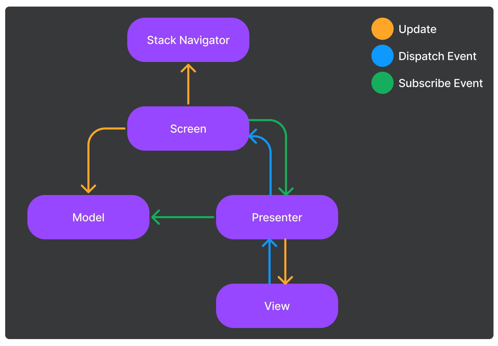
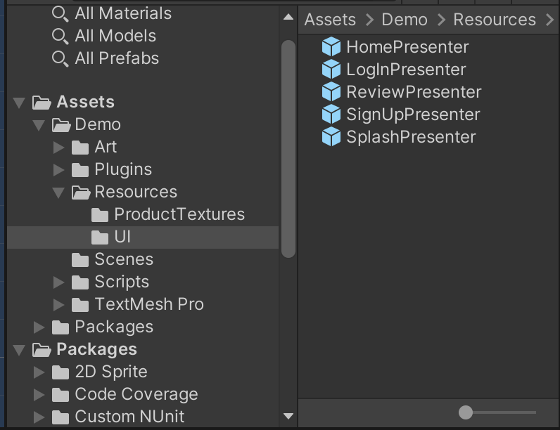
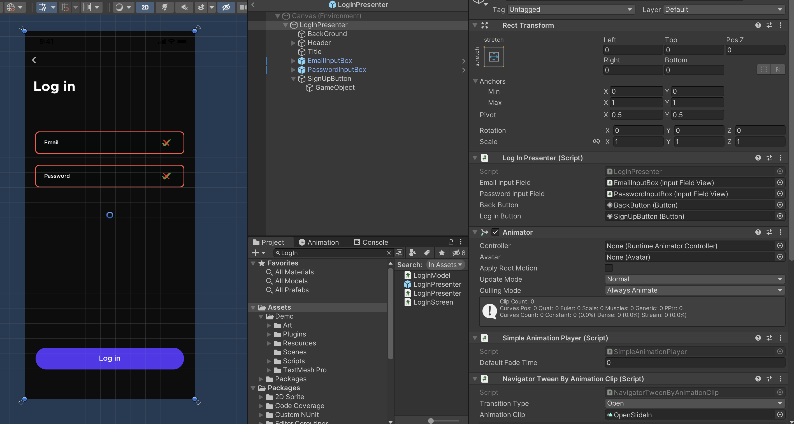
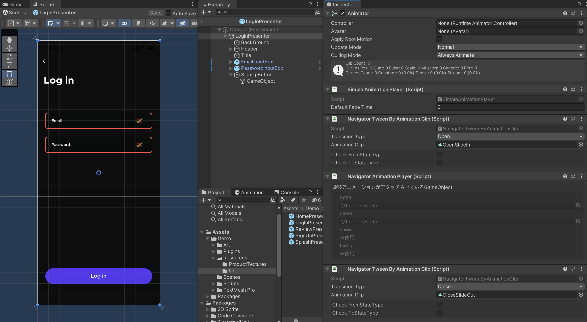

# Meek
Meekは、DIベースで実装されたUnityのユーザーインターフェイスを構築するためのライブラリです。  
主な機能としては、画面遷移や画面ライフサイクルの管理機能を提供しています。  
また、MVPアーキテクチャでの実装を容易にするためのツールも提供しています。  

<p align="center">
  
</p>

デモの中で使用している画像はフリーのコンテンツです。    
著作権に関する情報は以下のウェブサイトをご確認ください。  
[Nucleus UI](https://www.nucleus-ui.com/)

# 要件
- Unity 2021.3 (LTS) or newer
- uGUI
- [VContainer](https://github.com/hadashiA/VContainer)


# インストール
以下をPackages/manifest.jsonに追加する必要があります。  

```json
{
  "dependencies": {
    "jp.amatech.meek": "https://github.com/azumausu/Meek.git?path=Assets/Packages/Meek",
    "jp.amatech.meek.navigationstack": "https://github.com/azumausu/Meek.git?path=Assets/Packages/Meek.NavigationStack",
    "jp.amatech.meek.ugui": "https://github.com/azumausu/Meek.git?path=Assets/Packages/Meek.UGUI",
    "jp.amatech.meek.vcontainer": "https://github.com/azumausu/Meek.git?path=Assets/Packages/Meek.VContainer",
    "jp.amatech.meek.mvp": "https://github.com/azumausu/Meek.git?path=Assets/Packages/Meek.MVP",
    "jp.hadashikick.vcontainer": "https://github.com/hadashiA/VContainer.git?path=VContainer/Assets/VContainer"
  }
}
```

MVPパターンでの実装を行う場合は、[UniRx](https://github.com/neuecc/UniRx) を使用することをお勧めします。

# 基本的な使い方
## エントリポイント
```csharp
using Meek;
using Meek.MVP;
using UnityEngine;

namespace Demo
{
    public class Main : MonoBehaviour
    {
        [SerializeField] private InputLocker _inputLocker;
        [SerializeField] private PrefabViewManager _prefabViewManager;
        
        public void Start()
        {
            // ジェネリック引数は、最初に表示する画面のクラスを指定します。
            var app = new MVPApplication().CreateApp<SplashScreen>(
                // DIコンテナのサービスコレクションを作成するためのファクトリメソッドです。
                x => new VContainerServiceCollection(x),
                // 画面遷移時に入力をロックするためのクラスです。
                _inputLocker,
                // 画面遷移時に表示するプレハブを管理するクラスです。
                _prefabViewManager,
                x =>
                {
                    // 画面のクラスを登録します。
                    x.AddTransient<SplashScreen>();
                    x.AddTransient<SignUpScreen>();
                    x.AddTransient<LogInScreen>();
                    x.AddTransient<HomeScreen>();
                    x.AddTransient<ReviewScreen>();
                }
            );
        }
    }
}
```
MVPApplication().CreateApp<TScreen>()メソッドを呼び出すことで、アプリケーションを作成します。

InputLockerは以下のInterfaceを実装します。
```csharp
public interface IInputLocker
{
    // Inputをロックする
    IDisposable LockInput();

    public bool IsInputLocking { get; }
}
```
PrefabViewManagerは以下のInterfaceを実装します。
```csharp
public interface IPrefabViewManager
{
    // 管理しているPrefabの描画順を変更します
    // 画面遷移時に呼び出されます。
    void SortOrderInHierarchy(NavigationContext context);
    
    // 作成されたPrefabを管理下に追加する処理を実装します。
    void AddInHierarchy(PrefabViewHandler handler);
}
```
## MVP(Model-View-Presenter)
MeekのMVPアーキテクチャは、以下のような構成になっています。  
  
通常のMVPアーキテクチャとの違いは、PresenterがModelを更新するのではなくてScreenが更新するところです。
また、ModelやPresenterを作成するタイミングやPresenterへのModelのDIなどはライブラリ内で行っています。
### Screen
Screenは画面を表すクラスです。
MVPアーキテクチャで実装する場合は、以下の役割を持ちます。
- Modelの初期化
- Modelの更新
- Presenterの初期化
- Presenterのイベントを購読
- 他Screenへの遷移

```csharp
public class LogInScreen : MVPScreen<LogInModel>
{
    private readonly StackNavigationService _stackNavigationService;
    
    // DIコンテナから登録したServiceを取得できます。
    public LogInScreen(StackNavigationService stackNavigationService)
    {
        _stackNavigationService = stackNavigationService;
    }
    
    // Modelを作成します。
    protected override async ValueTask<LogInModel> CreateModelAsync()
    {
        return await Task.FromResult(new LogInModel());
    }

    // Screenのライフサイクルイベントを購読します。
    protected override void RegisterEvents(EventHolder eventHolder, LogInModel model)
    {
        // Screenが初期化される前に呼び出されます。
        eventHolder.ScreenWillStart(async () =>
        {
            // Presenterをロードします。
            var presenter = await LoadPresenterAsync<LogInPresenter>();

            // Presenterのイベントを購読します。
            // 以下は、別のScreenへ遷移するための処理を実装しています。
            presenter.OnClickBack.Subscribe(_ => _stackNavigationService.PopAsync().Forget());
            presenter.OnClickLogIn.Subscribe(_ => _stackNavigationService.PushAsync<HomeScreen>().Forget());

            // 以下は、Modelを更新する処理を実装しています。
            presenter.OnEndEditEmail.Subscribe(model.UpdateEmail);
            presenter.OnEndEditPassword.Subscribe(model.UpdatePassword);
        });
    }
}
```
CreateModelAsyncメソッドでModelを作成します。  
Modelを作成する際にServerとの通信などの非同期処理を挟めるようにasync/awaitを使用しています。
RegisterEventsメソッドでScreenのライフサイクルイベントを購読し必要な処理を実装します。  
サンプルでは、ScreenWillStart（Screenの初期化前）にPresenterをロードしてPresenterのイベントを購読しています。
また、1つのScreenに複数のPresenterをロードすることも可能です。

### Model
Modelは画面の状態を表すクラスです。
1つのScreenにつき1つのModelを持ちます。

```csharp
public class LogInModel
{
    // Modelの状態をReactivePropertyで定義します。
    private ReactiveProperty<string> _email = new();
    private ReactiveProperty<string> _password = new();
    
    public IReadOnlyReactiveProperty<string> Email => _email;
    public IReadOnlyReactiveProperty<string> Password => _password;
    
    // Modelの状態を更新する関数を実装します。
    public void UpdateEmail(string value)
    {
        _email.Value = value;
    }
    
    public void UpdatePassword(string value)
    {
        _password.Value = value;
    }

    public async Task LogInAsync()
    {
        // Log in 処理をここに実装します。
    }
}
```
### Presenter
Presenterは画面の表示を表すクラスです。  
Demoでは、Resources/UIディレクトリにPrefabを配置しロードしています。 


Prefabは以下の画像のように、RootNodeにPresenterをアタッチしています。


```csharp
public class LogInPresenter : Presenter<LogInModel>
{
    // ViewをSerializeFieldで定義します。
    [SerializeField] private InputFieldView _emailInputField;
    [SerializeField] private InputFieldView _passwordInputField;

    [SerializeField] private Button _backButton;
    [SerializeField] private Button _logInButton;

    // ViewのイベントをIObservableで定義します。
    public IObservable<Unit> OnClickBack => _backButton.OnClickAsObservable();
    public IObservable<Unit> OnClickLogIn => _logInButton.OnClickAsObservable();
    
    public IObservable<string> OnEndEditEmail => _emailInputField.OnEndEdit;
    public IObservable<string> OnEndEditPassword => _passwordInputField.OnEndEdit;

    // Modelのイベントを購読して、Viewの状態を更新する関数を呼び出します。
    protected override IEnumerable<IDisposable> Bind(LogInModel model)
    {
        yield return model.Email.Subscribe(x => _emailInputField.UpdateView(x));
        yield return model.Password.Subscribe(x => _passwordInputField.UpdateView(x));
    }
}
```
BindメソッドでModelのイベントを購読して、Viewの状態を更新する関数を呼び出します。  
また、Bind関数以外に以下の関数を実装することができます。  
```csharp
// Presenterがインスタンス化された時に呼び出されます。
protected virtual void OnInit() { }

// Presenterがロードされた時に呼び出されます。
// Presenterのロードに合わせて、UnityのSceneAssetや追加のPrefabをロードすることができます。
protected virtual Task LoadAsync(TModel model) { return Task.CompletedTask; }

// Bindの前に呼び出されます。
// 主にPresenterが持つViewの初期化処理を行ます。
protected virtual void OnSetup(TModel model) { }

// Presenterが破棄された時に呼び出されます。
protected virtual void OnDeinit(TModel model) { }
```

その他の実装のポイント
- Modelの状態を書き換えない  
=> 複雑になるとScreenとPresenterの双方でModelを書き換えることで可読性が下がります
- Presenterには極力ロジックは含めない  
=> PresenterはViewとModelをBindingする役割に留めた方が可読性が上がります
- Presenterには独自の関数を定義しない  
=> 理想的にはPresenterはロジックを持たないので、関数を定義する必要がないはずです
- Viewは純粋関数で構成する  
=> SSOT(Single Source of Truth)に従って、必ずModelが持つ状態が唯一の情報源となるように実装しましょう。

## Navigation
MeekのStackNavigatorは[MAUI](https://learn.microsoft.com/en-us/dotnet/maui/user-interface/pages/navigationpage?view=net-maui-7.0)のNavigation機能を参考にしています。  
以下の4つの機能があります。
- Push
- Pop
- InsertScreenBefore
- Remove

これらの4つの機能を組み合わせて、様々な画面遷移を実装します。  
> **注意**  
> StackNavigatorは、同じ型のScreenを同時に複数持つことができません。

> **ヒント**  
> StackNavigatorは、[Middleware](https://learn.microsoft.com/en-us/aspnet/core/fundamentals/middleware/?view=aspnetcore-7.0)を使用して実装しているので、Middlewareを継承して独自の機能を実装することも可能です。

### Push
Pushは、現在のScreenの上に新しいScreenを追加します。  
遷移先のScreenは、Generic引数で指定します。
```csharp
_stackNavigationService.PushAsync<ReviewScreen>();
```
非同期関数なので、Push処理が終了するまで待機することも可能です。
また、以下のように引数にParameterを渡すことで次のScreenに状態を渡すことができます。
```csharp
_stackNavigationService.PushAsync<ReviewScreen>(new ReviewScreenParameter()
{
    // ここに状態を渡します。
    ProductId = productId,
}).Forget();
```
上の例では、ReviewScreenに対してProductIdを渡しています。  
受け取る側のScreenでは以下のように実装します。
```csharp
// Generic引数の型にParameterを指定します。
public class ReviewScreen : MVPScreen<ReviewModel, ReviewScreenParameter>
{
    private readonly StackNavigationService _stackNavigationService;
    
    public ReviewScreen(StackNavigationService stackNavigationService)
    {
        _stackNavigationService = stackNavigationService;
    }
    
    // CreateModelAsync関数でParameterを受け取り、Modelを生成します。
    protected override async ValueTask<ReviewModel> CreateModelAsync(ReviewScreenParameter parameter)
    {
        return await Task.FromResult(new ReviewModel(parameter.ProductId));
    }
}
```

### Pop
Popは、現在のScreenを削除します。
```csharp
_stackNavigationService.PopAsync();
```

### InsertScreenBefore
ScreenStackの途中に新しいScreenを追加します。
Genericの第一引数で指定したScreenの上に、第二引数で指定したScreenを追加します。
```csharp
_stackNavigationService.InsertScreenBeforeAsync<SplashScreen, HomeScreen>();
```

### Remove
ScreenStackの途中にあるScreenを取り除きます。  
取り除きたいScreenは、Generic引数で指定します。
```csharp
_stackNavigationService.RemoveAsync<SignUpScreen>();
```

## Navigation Animation
StackNavigatorは、画面遷移時にアニメーションを実行することができます。
アニメーションには以下の4つの概念があります。 
#### Open
新しいScreenが表示される時に再生されるアニメーションです。
#### Close
現在のScreenが破棄される時に再生されるアニメーションです。
#### Show
Pop等の遷移処理で、非アクティブになっていたScreenに戻る時に再生されるアニメーションです。
#### Hide
Push等の遷移処理で、現在のScreenが非アクティブになる時に再生されるアニメーションです。


### AnimationClipを使用したアニメーション
AnimationClipでアニメーションを設定する場合、 Presenter用のPrefabにAnimatorと専用のコンポーネントをアタッチすることで実現できます。
  

StackNavigatorは、画面遷移時にアニメーションを実行することができます。  
アニメーションは、AnimationClipを使用して設定し、 Presenter用のPrefabにAnimatorと専用のコンポーネントをアタッチすることで設定できます。
1. NavigatorAnimationPlayerをPrefabのRootノードにアタッチする
2. NavigatorTweenByAnimationClipをアタッチする
3. NavigatorTweenByAnimationClipのAnimationClipとNavigationTypeを設定する

> **ヒント**  
> NavigatorAnimationPlayerがアタッチされているノードをクリックした状態でアニメーションウィンドウを開くと、AnimationClipの調整が可能です。


## Screen Lifecycle
#TODO
